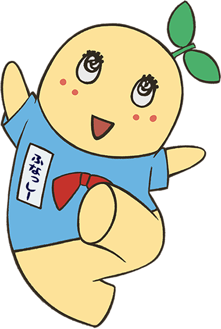

こんにちは世界

こんにちは
世界

こんにちは  
世界　　

こんにちは

世界

***こんにちは世界***

- レベル 0
- レベル 0
  - レベル 1 
  - レベル 1
    - レベル 2 
    - レベル 2
  - レベル 1
- レベル 0
  
1. レベル 0
1. レベル 0
   1. レベル 1 
   1. レベル 1
      1. レベル 2 
      1. レベル 2
   1. レベル 1
1. レベル 0

# レベル0

ほげ

## レベル1

ふが

### レベル2

ぴよ

ほげ[ふが](https://github.com/)ぴよ

[ほげ](./fuga/hoge.md)

